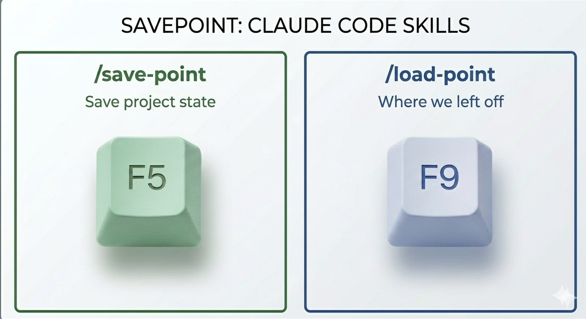

# Savepoint

Save and restore Claude Code project state across sessions. Two skills: `/save-point` captures where you left off, `/load-point` resumes without re-explanation.

> Tier-aware when the project has a `docs/PROJECT-MAP.md` - routes new knowledge to the right tier (hot memory, warm docs, cold archive) instead of dumping everything into one file. Works in flat mode too if the project hasn't adopted the pattern.



## Why this exists

I run multiple active projects. An intelligence pipeline, a content library, a couple of smaller scripts. Claude Code has memory - `CLAUDE.md` + per-project files under `~/.claude/projects/` auto-load every session - but it's only as good as what gets written to it. Without a habit of saving state at the end of each session, those files either stay empty or drift stale. Next time I opened a project I'd either scroll through yesterday's transcript or re-explain what I did last Thursday, what I tried that didn't work, what was almost done, what I was waiting on.

So I started writing a `project_state.md` at the end of every session. That worked for a month. Then it grew to 1,085 lines, carrying fourteen sessions of narrative, every decision I'd made, every gotcha I'd hit. The file was doing too many jobs - resumption point, decision log, reference manual, rejected-approaches graveyard - and the agent's memory search kept returning stale bits alongside current ones.

So I split it. Current state stays hot. Shipped decisions go to Architecture Decision Records (ADRs) - short, dated notes that capture what was decided and why, committed to git so they don't drift. Parked work gets a "revive when" trigger. Old sessions roll to a cold archive. The skills here now route new knowledge to the right tier instead of dumping everything into `project_state.md`. Lighter context window, readable history, no archaeology next session.

## What it does

Two commands. One saves, one restores.

```
/save-point
```

Captures what happened in the current session and routes it:

- New decision with rationale → new ADR in `docs/decisions/`
- Parked initiative → `docs/parked/<slug>.md` with a "Revive when:" trigger
- Behavioral rule → `memory/feedback_<slug>.md`
- Session narrative → `project_state.md` (trimmed; older sessions roll to archive)

Falls back to a single-file `project_state.md` dump if the project doesn't use the tier pattern.

```
/load-point
```

Reads the saved state shallow-to-deep - `MEMORY.md` → `open_action_items.md` → `project_state.md` → `PROJECT-MAP.md` → architecture/ops only if the task needs them. Verifies against `git status` so stale hints don't get acted on silently. Presents a brief orientation and the next action.

## What it is and what it is not

It **is**:

- A pair of skills that enforce memory hygiene at session boundaries
- A lightweight way to split one monolithic state file into a tiered memory + docs structure
- Safe for existing projects - flat mode keeps working unchanged until you opt in

It **is not**:

- A general-purpose memory framework. Scope is Claude Code projects, not multi-agent systems or cross-tool state sync.
- A wiki or documentation generator. It routes knowledge you produce during a session. It doesn't write your docs for you.
- A replacement for git. State files are hints. The repo is truth.

## Design choices worth explaining

A few places where I picked one option and the alternative wasn't obviously worse. If you're adapting this for your own setup, these are the forks.

**Three tiers.** Hot loads every session, warm is grep-on-demand in git, cold is archive. I didn't work backward from two or five - three just fell out of naming what I wanted loading every session versus what I wanted reachable but not noisy. Two tiers runs back into the monolith problem. More than three starts producing "where does this belong" arguments with the agent, and the agent tends to resolve them inconsistently.

**Skills, not hooks.** Saving state should be a deliberate act. If I automated it, the skill would save everything including the noise, and noise is what got me to 1,085 lines in the first place. Typing `/save-point` forces me to name what I'm actually saving.

**Opt-in tier mode.** Auto-migration is nicer to install and worse to live with. Tiers only earn their keep on projects with real history. On a weekend script they're overhead. The skill looks for `PROJECT-MAP.md` and only switches modes if it finds one - install and nothing changes unless you opt in.

**ADRs, not a wiki.** A wiki is for pages you keep editing. ADRs get written on the day the decision happens, dated, committed, and left alone. For decision provenance I wanted the second thing. MADR already had the format, I just wrote the rules that route new decisions into it.

**Trim at sessions, not line count.** Line counts drift with how chatty I was that week. "Three sessions back" is something I can reason about at 11pm, which is usually when I notice things are getting heavy.

## Memory tier system

The skill separates four kinds of knowledge:

| Tier | Where it lives | When loaded | What's in it |
|---|---|---|---|
| **Hot** | `.claude/memory/` | Every session (`MEMORY.md` auto) + on-demand | Active work, current session, evergreen behavioral rules |
| **Warm** | `docs/` (git-versioned) | On demand | Architecture, ADRs, roadmap, reference, parked items |
| **Cold** | `.claude/memory/archive/` + `docs/**/archive/` | Only when explicitly searching history | Superseded snapshots, ADR provenance, old session narratives |

A fourth kind lives in the project's code/config itself - anything derivable from reading files or `git log` should stay there, not in memory.

Full template at [`references/memory-tier-template.md`](references/memory-tier-template.md). A `docs/PROJECT-MAP.md` skeleton at [`references/project-map-template.md`](references/project-map-template.md). The six rules the skills enforce at [`references/rollover-rules.md`](references/rollover-rules.md).

## Installation

### Claude Code (CLI or Desktop)

Copy both skills into your commands directory:

```bash
git clone https://github.com/belousov-petr/savepoint.git
cp savepoint/save-point.md ~/.claude/commands/save-point.md
cp savepoint/load-point.md ~/.claude/commands/load-point.md
```

Or grab them directly:

```bash
curl -o ~/.claude/commands/save-point.md \
  https://raw.githubusercontent.com/belousov-petr/savepoint/main/save-point.md
curl -o ~/.claude/commands/load-point.md \
  https://raw.githubusercontent.com/belousov-petr/savepoint/main/load-point.md
```

Restart Claude Code. The skills appear as `/save-point` and `/load-point`.

### Opt in to tier mode (per project)

Tier mode activates automatically when `docs/PROJECT-MAP.md` exists in the project root. To set it up:

```bash
# from the project root
mkdir -p docs/decisions docs/reference docs/parked
curl -o docs/PROJECT-MAP.md \
  https://raw.githubusercontent.com/belousov-petr/savepoint/main/references/project-map-template.md
```

Then edit `PROJECT-MAP.md` - fill in what the project is, what lives where, and any project-specific rows in the "Where do I look for X?" table. Hook your project's `CLAUDE.md` with:

```markdown
## Orientation
Before memory operations or deep work, consult `docs/PROJECT-MAP.md`.
```

`/save-point` will detect it on the next run and switch to tier mode automatically.

### Migrating an existing project

If you already have a sprawling `project_state.md`, run `/save-point` and it'll offer to migrate once the file crosses ~500 lines. Or explicitly ask: "migrate this project to the tier pattern." See the [migration section in the tier template](references/memory-tier-template.md#migrating-an-existing-project) for the step-by-step.

## How save-point works

On trigger, `/save-point`:

1. **Detects mode** - tier mode if `docs/PROJECT-MAP.md` exists; flat mode otherwise. Announces which one.
2. **Reads current memory** - `MEMORY.md`, `project_state.md`, active project/feedback files.
3. **Inventories this session's work** - code changes, decisions, experiments, failures, verifications.
4. **Captures the resumption point** - last completed action, immediate next action, prerequisites, uncommitted changes.
5. **Routes new knowledge to the right tier** (tier mode) - decisions to ADRs, parked to `docs/parked/`, rules to `feedback_*.md`, narrative to `project_state.md`.
6. **Applies rollover discipline** (tier mode) - trims `project_state.md` at 3+ sessions, promotes shipped initiatives to ADRs, parks stalled ones, archives older sessions.
7. **Updates `MEMORY.md`** - keeps the index lean in tier mode, updates the one-liner in flat mode.
8. **Fixes stale references** - scans for statements this session made wrong.
9. **Updates the project README** - if present and this session changed user-facing behavior.
10. **Verifies** - re-reads the saved state, confirms it's actionable.
11. **Reports** - what was saved where, what got extracted, what got archived.

Full skill at [`save-point.md`](save-point.md).

## How load-point works

On a fresh session:

1. **Detects mode** - tier or flat.
2. **Loads shallow-to-deep** - `MEMORY.md` → `open_action_items.md` → `project_state.md` → `PROJECT-MAP.md` → architecture/ops only if the task needs them. No bulk-loading ADRs, parked items, or archives.
3. **Orients from "WHERE WE LEFT OFF"** - pulls last action, next action, prerequisites, uncommitted scope.
4. **Verifies against git** - `git status`, `git log --oneline -5`, spot-check referenced files. Flags drift instead of silently acting on stale state.
5. **Presents a brief summary** - what was last done, what's next, open items, prerequisites.
6. **Starts the next action on confirm** - without re-exploring the codebase.

Full skill at [`load-point.md`](load-point.md).

## Project structure

```
savepoint/
├── save-point.md                  # The /save-point skill (tier-aware)
├── load-point.md                  # The /load-point skill (tier-aware)
├── references/
│   ├── memory-tier-template.md    # Three-tier pattern - full template
│   ├── project-map-template.md    # docs/PROJECT-MAP.md skeleton
│   └── rollover-rules.md          # The six rules the skills enforce
├── Savepoint.png                  # Hero image
├── README.md
└── LICENSE                        # MIT
```

## A few honest things

A few caveats before you lean on this.

- **Trust `git status` when it disagrees with the state file.** Load-point is supposed to flag the mismatch, but the flag is just text on the screen. If you skim past it, you're back to the problem it was meant to prevent.

- **Tier mode earns its keep on projects with real history.** On a weekend prototype, flat mode is fine and ADRs are overkill. The skill doesn't force you in. It switches over when it sees a `PROJECT-MAP.md` at the repo root.

- **Where knowledge belongs is a judgment call.** Is a new caveat a behavioral rule (hot feedback) or a gotcha someone will grep for once a quarter (warm reference)? I've landed wrong on this often enough. In doubt, leave it in hot memory and let the next session's `/save-point` promote it if it turns out evergreen.

- **Archiving keeps the file around.** Files that roll to `memory/archive/` or `docs/ops/archive/` keep the same git tracking and the same grep-ability. What changes is whether the agent loads them without being asked.

- **Migration is reversible inside a session.** If you run `/save-point` with the migration option and don't like the result, `git restore` the docs and memory, delete `docs/PROJECT-MAP.md`, and the next run is back to flat mode. Commit the pre-migration state first so you have a clean restore point.

## What building this taught me

**A single file doesn't stay cheap.** The agent's memory search pulls from it every session, and the bigger the file, the more old and new get returned side by side. Ten sessions in, mine was still surfacing tasks I'd closed three weeks earlier. So I split it. Four smaller files, each narrow enough that memory search mostly pulls from the right one.

**The three-tier shape is borrowed.** Git has it. ADRs have it. Incident-response playbooks had it before Claude Code existed. Current state, decisions, archive. I only noticed the overlap after I'd built most of this, which is its own kind of embarrassing. Whatever's original here is the application to Claude Code. Sources in Acknowledgments.

**A drifting state file costs more than no state file.** A month in, mine had action items that had been closed for weeks, questions I'd answered in session two, and paragraphs that contradicted each other outright. Each was true when I wrote it; none were true together. Once you stop trusting the file, you go check the code anyway before acting on anything, and at that point reading the file is wasted motion. That's what pushed me toward the split and the routing rules.

## Contributing

If you've run this and found gaps, I'd like to hear about it. Open an issue or PR with:

1. What kind of project you ran it on
2. What the routing got wrong
3. What you'd add to fix it

## License

[MIT](LICENSE). Use it, fork it, ship it - credit appreciated but not required.

## Acknowledgments

Claude Code ([@claude](https://github.com/claude)) wrote this - the skills, the templates, this README. I designed the tier system, the routing rules, and the rollover discipline. Division of labor: mine is judgment, Claude's is typing speed.

The three-tier pattern borrows from Michael Nygard's [original ADR post](https://cognitect.com/blog/2011/11/15/documenting-architecture-decisions), the [MADR](https://adr.github.io/madr/) format, and incident-response playbook conventions. None of those were built for Claude Code. They just converge on the same separation, and that convergence is what made me trust the structure.

Companion skill: [`/shakedown`](https://github.com/belousov-petr/shakedown) for auditing what's broken in a project before you ship.

## Author

Petr Belousov

- GitHub: [@belousov-petr](https://github.com/belousov-petr)
- LinkedIn: [petrbelousov](https://www.linkedin.com/in/petrbelousov/)
