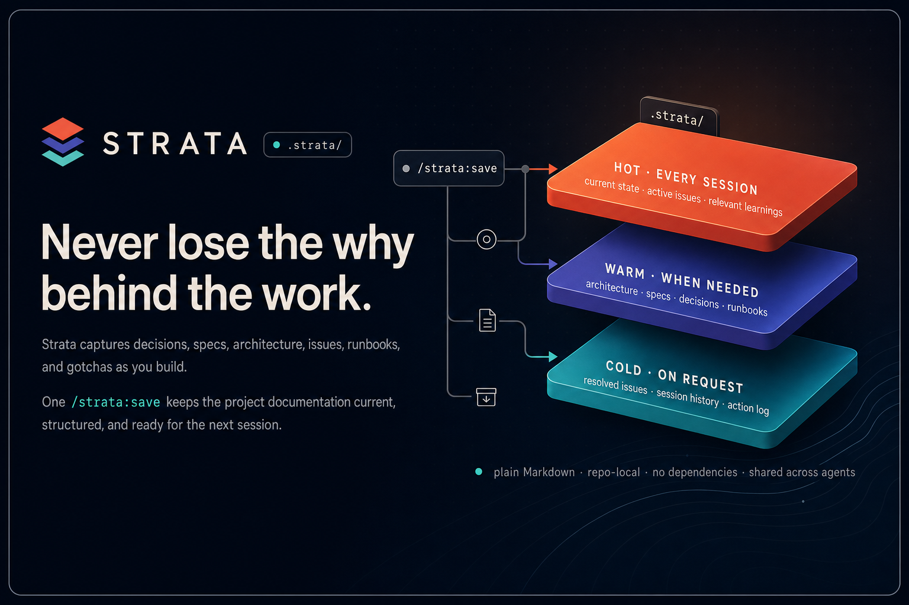

# Strata

Strata is project memory for AI coding agents, kept in your repo. It saves what you learn about a project in plain Markdown files under `.strata/`. Claude Code, Codex, Gemini, and other tools all read the same files, so they share one memory instead of each keeping their own.

It installs as a plugin for both Claude Code and Codex from this one repo.

- On-disk format: `strata_version: 3`
- Plugin version: `3.1.0` (Claude Code and Codex)



## What it does

- Keeps project memory in one place, `.strata/`, that any tool can read.
- Splits that memory into three layers: recent state loaded every session, deeper docs loaded when a task needs them, old history searched only when you ask.
- Tracks findings, bugs, tasks, and ideas in one backlog, with views that regenerate themselves.
- Saves lessons by trigger, so the agent reads the one note it needs before an action, not the whole folder.
- Writes findings to disk the moment they happen, before compaction can lose them.
- Sets up a new project, or migrates old memory, in one command.
- Adds an optional hook that reminds the agent to save findings before compaction, on both tools and all three operating systems.
- Uses plain Markdown and grep. No dependencies.

## Why this exists

An agent learns a lot in one session that never reaches the code. A build fails and it finds a fix. A flaky dependency needs a workaround. A test fails at random and it figures out why. These are small facts, and most of them only live in the chat. Then the context window fills up, the session compacts, and those facts are gone. A week later you solve the same problem again.

Strata stops that. While you work, it writes what you learn to disk right away: findings, gotchas, workarounds, decisions, and the reasons behind them. The files go under `.strata/`, as plain Markdown, before compaction can drop them.

Writing everything down causes a new problem: too many notes. A big pile of notes hides the one you need, and it costs tokens every time a session loads it. So strata keeps notes in layers. Recent state and the indexes stay small and load every session (the main index is capped at 80 lines). Deeper notes, like how a part of the system works or why a decision was made, load only when the task needs them. Old history sits at the bottom and stays out of the way until you search for it. You get the detail back when you need it, without paying for all of it every time.

This does not replace git. Git already saves the files and their history. What git does not do is tell the agent which file to read, or when, or keep the always-loaded set small. That is what strata adds: where each note belongs, when it loads, and when it moves down a layer. The files stay plain Markdown, so any tool can read them. If you want graph or vector search on top, point an engine like [Graphiti](https://help.getzep.com/graphiti/getting-started/overview) at the same files. Strata owns the structure; the engine owns search.

## Why the name

Strata, like rock. Sediment settles in layers over time, and later you can read the whole history in a cliff or a core sample. The name fits: your notes build up in layers too, recent on top and older underneath.

The first name was "Savepoint," because that was the verb I typed. But the verb is not the point. The point is underneath: which layer a note belongs to, and when it loads.

## What's in this repo

```
strata/
├── .claude-plugin/
│   ├── plugin.json                # Claude Code plugin manifest
│   └── marketplace.json           # single-plugin marketplace (source ".")
├── .codex-plugin/plugin.json      # Codex plugin manifest
├── commands/                      # Claude slash commands
│   ├── save.md                    #   → /strata:save
│   ├── load.md                    #   → /strata:load
│   └── capture.md                 #   → /strata:capture
├── skills/
│   └── strata/
│       ├── SKILL.md               # the rules (the Claude + Codex skill)
│       └── templates/             # copied into projects by init (mirrors .strata/)
├── hooks/                         # optional capture-guard hook (Claude + Codex, all OSes)
│   ├── strata-capture-guard.mjs   #   shared Node script
│   ├── hooks.json                 #   Claude plugin hook config
│   ├── codex-hooks.sample.json    #   Codex hook template
│   └── README.md
├── docs/
│   ├── DESIGN.md                  # the long reference: every store, schema, lifecycle
│   └── decisions/                 # ADR-0001..0010: why strata is built this way
├── MIGRATIONS.md                  # flat/v1/v2 → v3 ladder: detect, transform, roll back
├── CHANGELOG.md                   # what changed per release
└── tests/                         # scaffold check + repo lints
```

The skill holds the rules. The commands are the verbs you type. I once put the rules in the command files, and within a week they drifted out of sync, so now they live in one place. The docs work the same way: the skill stays short and practical, [DESIGN.md](docs/DESIGN.md) holds the detail, and the [ADRs](docs/decisions/README.md) hold the reasons.

## The shape of a strata project

When you run init on a fresh project, strata creates this:

```
<project>/
├── AGENTS.md · CLAUDE.md          # thin adapters → .strata/MANIFEST.md
├── README.md                      # your project's front door
└── .strata/
    ├── MANIFEST.md                # the contract: version, structure, routing, load order
    ├── memory/                    # HOT
    │   ├── MEMORY.md              # index only: live pointers + rules-by-trigger table (≤80 lines)
    │   ├── project_state.md       # current + last session (≤200 lines)
    │   ├── learnings/             # lessons keyed by trigger + a generated INDEX.md
    │   └── archive/               # COLD: old sessions, ADR sources, action_log.md
    ├── issues/                    # the one backlog
    │   ├── ACTIVE.md · OPEN.md · PARKED.md    # generated views
    │   ├── <id>-<slug>.md         # one item per file
    │   └── archive/               # resolved / wont-fix
    └── docs/                      # WARM, grows as needed
        ├── ARCHITECTURE.md        # code map + index
        ├── product/ · architecture/ · decisions/ · reference/ · ops/
        └── CHANGELOG.md · roadmap.md   (when they exist)
```

Everything strata owns lives under `.strata/`. Like a lockfile, the folder states its format and version (`strata_version: 3` in the manifest), so it won't clash with anything and any tool can read it ([ADR-0001](docs/decisions/ADR-0001-strata-namespace-commands-adapters.md)). The adapters are thin pointers. `AGENTS.md` still has room for your own build, test, and style notes.

If memory already exists, init follows [MIGRATIONS.md](MIGRATIONS.md). A flat `project_state.md` is archived as `memory/archive/source-flat-project-state-*` before the new layout is written.

## The memory model

Each store answers one kind of question. That question is its key:

| Store | Key | The question it answers | Tier |
|---|---|---|---|
| `memory/project_state.md` | recency | "What was I doing?" | hot |
| `memory/learnings/` | operation | "What do I know about doing this?" | hot index, fired on match |
| `issues/` | status | "What work exists, and in what state?" | hot view, warm items |
| `docs/` | topic | "What is true, how, and why?" | warm |
| `archive/` + `action_log.md` | time | "What happened? Did we send X?" | cold |

Anything you can get from the repo itself (the code, `git log`, the folder layout) gets no store. Files bloat when one file answers several questions. One key per store is the main rule.

### What happens when

| Moment | Reads and writes |
|---|---|
| `/strata:load` | `MANIFEST.md` → `MEMORY.md` → `issues/ACTIVE.md` → `project_state.md` (current + last) |
| A fresh failure or gotcha | `/strata:capture` writes the issue, the learning, or both, right away |
| Picking new work | `issues/OPEN.md`, filtered by area |
| About to do task X | the one or two `learnings/` files whose trigger matches |
| A task touches a topic | the one `.strata/docs/` file for that topic |
| A question about history | `archive/`, by grep |
| Never on its own | learnings in bulk, ADRs in bulk, items in bulk, anything in archive |

Long docs are fine in the warm tier. Bloat only hurts the always-loaded files, and those are held small by budgets and routing, not by writing less.

## The backlog

One store holds findings, tasks, and ideas: `.strata/issues/`, one file per item, keyed by frontmatter ([ADR-0002](docs/decisions/ADR-0002-unified-issues-backlog.md)).

- Capture is immediate. The moment a finding or bug shows up mid-task, `/strata:capture` writes the file with full notes (Tried, Error, Hypothesis, Repro), marks it `open`, then work continues. Compaction can't delete what is already on disk.
- Types are `bug | improvement | debt | task | feature | initiative`. Statuses are `open | in-progress | parked | resolved | wont-fix`. Parked work is a status with a required `revive-when:` trigger.
- Status is a frontmatter edit, not a file move. Closed items move to `issues/archive/` and stay searchable.
- The views are generated. `ACTIVE.md`, `OPEN.md`, and `PARKED.md` rebuild from item frontmatter at every `/strata:save` ([ADR-0004](docs/decisions/ADR-0004-generated-indexes-grep-router.md)).

`action_log.md` is separate on purpose. It is an append-only list of things that left the repo: a PR, an email, a posted comment with a real URL. An issue tracks work. The action log records that something reached the outside world.

## Learnings

A learning is a lesson from a success or a failure ([ADR-0003](docs/decisions/ADR-0003-operation-keyed-learnings.md)). Each one has a trigger, so the agent can read the one relevant note before it acts, instead of loading the whole folder.

```
---
trigger: before pushing to a shared branch
origin: failure
---
**Lesson:** Run the repo lint first. The hook catches secrets, not broken
cross-references.
```

The key is the operation, not the date. A by-trigger table in `MEMORY.md` keeps lookups fast. Failures with their fix are usually the most useful entries.

## The commands and init

### `/strata:capture`

Use this while you work, not at the end. Use it when a command fails, when the agent retries with a workaround, when a brittle setup rule shows up, or when a finding is too useful to leave in the chat.

It writes or updates:

- an issue under `.strata/issues/` when there is work to close
- a learning under `.strata/memory/learnings/` when the value is a reusable rule
- both when a fixable problem also taught a future lesson

It does not rebuild the generated views. `/strata:save` does that later, so `ACTIVE.md`, `OPEN.md`, `PARKED.md`, `learnings/INDEX.md`, and the `MEMORY.md` table stay in sync with the source files.

### `/strata:save`

It reads the session (resumption point, issue events, learnings, decisions, doc impact, finished external actions), routes each thing to its store, and shows one preview block before it writes:

```
Proposed changes for /strata:save:

NEW FILES:
- .strata/issues/20260609-02-router-drift.md  ← finding, full notes
- .strata/memory/learnings/bulk-renames.md  ← "before bulk renames…"
- .strata/docs/decisions/ADR-0007-queue-drain.md  ← promoted

UPDATES (frontmatter / sections):
- .strata/issues/20260601-01-flaky-probe.md: status in-progress → resolved

MOVES:
- .strata/issues/20260601-01-flaky-probe.md → issues/archive/

DELETIONS (section-only):
- project_state.md: roll session 12 → archive/2026-06-sessions-11-12.md

REGENERATED:
- issues/ACTIVE.md · OPEN.md · PARKED.md · learnings/INDEX.md · MEMORY.md trigger table
```

Invoking `/strata:save` is the confirmation. There is no second yes/no gate. It has guards: it never moves a git-dirty file, it checks ADR numbers for collisions, it only deletes sections (never whole files), and a re-run with nothing new proposes nothing.

### `/strata:load`

It loads shallow to deep (`MANIFEST` → `MEMORY` → `ACTIVE` → state), checks against git (`git status`, recent commits, spot-checks), then sums up in six lines: last session, next action, active items, prerequisites, fired triggers, and any drift. State is a hint. The repo is the truth.

### Init

One command to scaffold or migrate. In Claude Code, run `Skill(name='strata:strata', args='init')`. In Codex, run `Skill(name='strata', args='init')`.

A fresh project answers two questions (project name, and code or knowledge project), then gets the tree above, with adapters written only if they are missing. Flat memory is archived and migrated, not overwritten. v1 and v2 layouts go through the migration ladder instead of starting a second memory.

## Installation

This is one repo with two plugin manifests. Claude Code reads `.claude-plugin/`, Codex reads `.codex-plugin/`, and both load the same `skills/strata/SKILL.md`. Nothing is duplicated.

### Claude Code (plugin)

`.claude-plugin/plugin.json` is the plugin manifest. `.claude-plugin/marketplace.json` lists this repo as a one-plugin marketplace (`source: "."`).

Install from GitHub:

```text
/plugin marketplace add belousov-petr/strata
/plugin install strata@belousov-petr
```

Under the plugin, Claude puts the plugin name in front of every command and skill:

- Commands: `/strata:save`, `/strata:load`, `/strata:capture`
- Skill: `Skill(name='strata:strata')`, with `args='init'` or `args='capture'`

Update after new commits, then restart Claude Code. An update does not rewrite the instructions already loaded in the running session.

```text
/plugin marketplace update belousov-petr
/plugin update strata@belousov-petr
```

Turn it off or remove it:

```text
/plugin disable strata
/plugin uninstall strata
```

For local work, load a clone for one session, or add it as a local marketplace:

```bash
git clone https://github.com/belousov-petr/strata.git
claude --plugin-dir ./strata            # this session only
# or, inside Claude Code:
#   /plugin marketplace add ./strata
#   /plugin install strata@belousov-petr
```

A local-directory install caches the plugin per version. After you edit a local clone, reinstall (`/plugin uninstall strata` then `/plugin install …`) to pick up the change. `update` does nothing for that kind of install.

Check the manifests before you publish:

```bash
claude plugin validate . --strict
```

### Codex (plugin)

The Codex manifest is `.codex-plugin/plugin.json`, which points at `skills/strata/`. Clone this repo into your Codex plugin source directory and install it through your Codex plugin marketplace. After you pull new commits, reinstall or update so Codex refreshes its copy, then start a new thread.

Codex calls the skill directly, with no plugin prefix:

```text
Skill(name='strata', args='init')
Skill(name='strata', args='capture')
Skill(name='strata')                    # rule lookup that drives the load/save flow
```

That bare `strata` is why the skill keeps `name: strata`. It is the name Codex and other tools rely on.

### Other tools

`AGENTS.md` is the entry point. Codex reads it on its own. For Gemini CLI, point the project context at `AGENTS.md` (the `settings.json` context setting, or an import line). Any tool that does not read `AGENTS.md` can use a thin adapter that points to `.strata/MANIFEST.md`.

### Automatic capture (optional hook)

Strata has an optional hook (`hooks/`) that reminds the agent to write findings to `.strata/` before the context is compacted. It works on Claude Code and Codex, on Windows, macOS, and Linux. One shared Node script ([`hooks/strata-capture-guard.mjs`](hooks/strata-capture-guard.mjs)) adds the capture reminder at `SessionStart` and a last-chance reminder at `PreCompact`. It says nothing outside a strata project, and if it errors it exits cleanly, so it can't stall a session.

- Claude Code: it ships in the plugin (`hooks/hooks.json`, picked up when the plugin is on). Nothing to set up. Turn it off with `/plugin disable strata`.
- Codex: plugins can't carry hooks, so copy [`hooks/codex-hooks.sample.json`](hooks/codex-hooks.sample.json) to `~/.codex/hooks.json` (every project on the machine) or to a committed `<project>/.codex/hooks.json` (travels with the repo). Set the `commandWindows` field on Windows.

One limit: neither tool lets a hook force a save before compaction. `PreCompact` can't make the agent act first. The hook reminds; the agent still does the capture. So strata stays a convention. More in [`hooks/README.md`](hooks/README.md).

### Set up a project

In the project root, run init: `Skill(name='strata:strata', args='init')` in Claude Code, or `Skill(name='strata', args='init')` in Codex. A fresh project answers two questions and gets the tree above, with `AGENTS.md` and `CLAUDE.md` written only if missing. A project with flat or old memory goes through `MIGRATIONS.md`, and the source is archived before any new file is written.

## Migrating from flat, v1, or v2

[`MIGRATIONS.md`](MIGRATIONS.md) is the ladder. It detects which version you have by checking which files exist (flat: `.strata/memory/project_state.md` with no manifest; v1: `docs/PROJECT-MAP.md` or `.claude/memory/`; v2: `.ai/MEMORY-MAP.md`), then makes the change step by step, with a backup to roll back to. Flat memory moves into `memory/archive/source-flat-project-state-*` before the new state is written. The v1 and v2 paths rename the namespace, rewrite the manifest, pull `open_action_items.md`, `project_<slug>.md`, and `docs/parked/` into the issues backlog, turn `feedback_*` files into learnings, and rebuild the views. Every step that holds content archives its source before deleting anything. The old `/save-point` and `/load-point` names are gone. Install the plugin as shown above.

## Versioning

There are two version numbers, and they mean different things.

- `strata_version: 3` is the on-disk format, stamped in every scaffolded `MANIFEST.md`. A change here is breaking and ships with a `MIGRATIONS.md` step. The plugin packaging (3.1.0) did not change it, so a project already on v3 needs no migration when you move to the plugin.
- `3.1.0` is the plugin version in `.claude-plugin/plugin.json` and `.codex-plugin/plugin.json`. It is the release of the tool itself.

Releases are git tags plus `CHANGELOG.md` plus ADR supersede notes. There are no per-folder version archives ([ADR-0008](docs/decisions/ADR-0008-git-native-versioning.md)). The last tagged format release is `v3.0.0`. Current `main` has the plugin, capture, and hook work listed under Unreleased in [`CHANGELOG.md`](CHANGELOG.md).

## What I learned from the research

The [ADRs](docs/decisions/README.md) hold the notes and the trade-offs. The short version:

- Agent instruction files need one source, not several copies that drift. Strata keeps that source in `MANIFEST.md` and keeps the adapters thin.
- Always-loaded memory should stay small. The hot files point at the next action and the right indexes. The warm docs hold the depth.
- Lessons work best tied to an operation. `learnings/` stores "before doing X, read Y" rules, not diary entries.
- The generated views are copies. The item files and learning files are the truth.
- Decision records keep reasons out of hot memory. Strata uses ADRs for the durable "why," with the source material archived.

The main influences: [agents.md](https://agents.md/), [Anthropic's writing on context engineering](https://www.anthropic.com/engineering/effective-context-engineering-for-ai-agents), and tiered memory systems like [Cline Memory Bank](https://docs.cline.bot/features/memory-bank) and [Letta/MemGPT](https://www.letta.com/blog/agent-memory). For the structure and docs: [ReasoningBank](https://arxiv.org/html/2509.25140v1), [Nygard's ADRs](https://www.cognitect.com/blog/2011/11/15/documenting-architecture-decisions), the [MADR](https://adr.github.io/madr/) format, and [Diátaxis](https://diataxis.fr/start-here/).

## A few honest things

- If `git status` and the state file disagree, trust git. `/strata:load` flags the mismatch, but the flag is only text on the screen.
- The save preview is a record, not a gate. `/strata:save` writes after the preview on its own, so a misclassified note can still move if the session read was wrong.
- Where a note belongs is still a judgment call. The simple tests (rule vs procedure vs fact, issue vs learning) handle most cases. When in doubt, leave it hot and let the next save sort it.
- The generated views are only as fresh as the last save. The items are the truth. The views are a copy with a rebuild step.
- Strata is a convention, not a daemon. Nothing forces the capture rule except the skill's instructions and your habit. The optional hook (`hooks/`) reminds you at session start and before compaction, but it only reminds. It can't force the save. The structure makes the right thing cheap. It can't make the wrong thing impossible.

## What building this taught me

- A single file does not stay cheap. Memory search pulls from it every session, and old and new come back together. Splitting by key fixed what splitting by size never did.
- The dumping ground moves. I fixed `project_state.md` in v1, then watched `open_action_items.md` quietly become the same thing: one file, several jobs, drifting sections. The fix was not a better file. It was admitting that work items are a list, not a document.
- Findings die in compaction. The worst v2 failure was invisible: a sharp diagnosis made mid-task, kept in the chat for the save ritual, gone when the context compacted. Writing to disk right away is the most important rule in v3.
- Hand-kept lists lie. Every status list I kept by hand ended up disagreeing with reality. Views built from item frontmatter can't.
- Git already solved versioning. I almost built per-folder version archives before I noticed I was building a worse version of `git log`. Tags, a changelog, and supersede notes cover what I needed ([ADR-0008](docs/decisions/ADR-0008-git-native-versioning.md)).
- The research checked more than it changed. The deep-research pass kept about 85% of v2. The value was in the corrections it forced me to name, and in being able to cite why the structure is the way it is instead of "it felt right."

## Contributing

If you have run this and found gaps, I want to hear about it. Open an issue or PR with what kind of project you ran it on, what the routing got wrong (or what the save preview let through), and what you would change.

## License

[MIT](LICENSE). Use it, fork it, ship it. Credit is appreciated, not required.

## Acknowledgments

The first version was drafted in [Claude Code](https://claude.com/claude-code) ([@claude](https://github.com/claude)). I designed the tier model and the routing rules, decided what knowledge goes where and why, and directed the work.

The pattern builds on prior work: Michael Nygard's [ADRs](https://cognitect.com/blog/2011/11/15/documenting-architecture-decisions), the [MADR](https://adr.github.io/madr/) format, incident-response playbooks, and the 2024-2026 work on agent memory credited above and in the ADRs.

Companion skill: [`/shakedown`](https://github.com/belousov-petr/shakedown), for finding what is broken in a project before you ship.

## Author

Petr Belousov

- GitHub: [@belousov-petr](https://github.com/belousov-petr)
- LinkedIn: [petrbelousov](https://www.linkedin.com/in/petrbelousov/)
