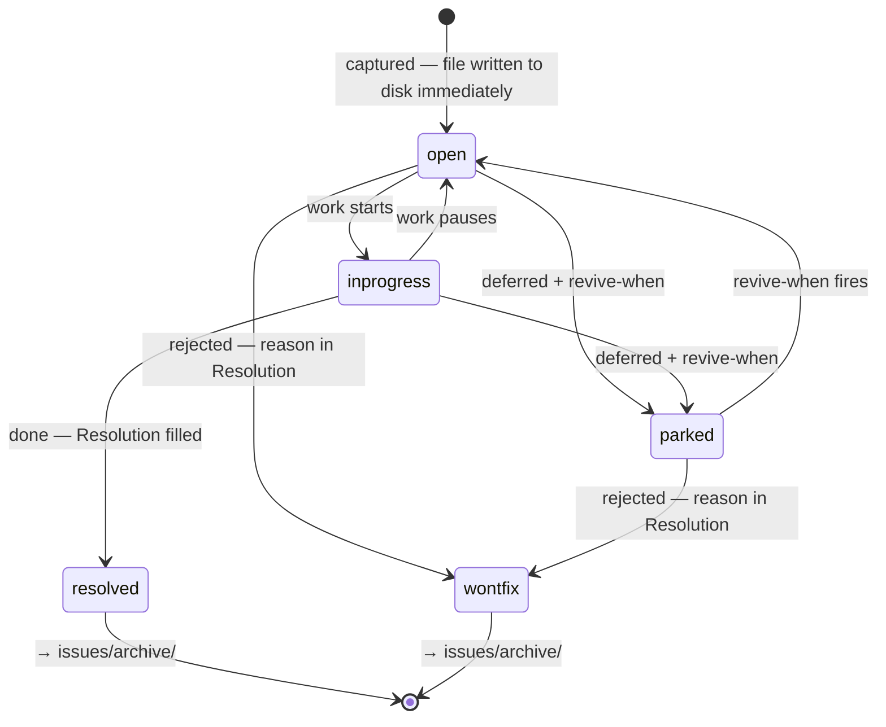

# Strata 0.0.3 — Design Reference

The exhaustive description of the 0.0.3 system: every store, every schema, every lifecycle rule, and the mechanics that hold them together. This is the **warm** document — read it when you need depth, not at session start.

Layering (per [ADR-0005](decisions/ADR-0005-layered-self-documenting-docs.md)):

| Question | Document |
|---|---|
| How do I run a save/load/init right now? | [`skills/strata/SKILL.md`](../skills/strata/SKILL.md) (operational rules, loads on invoke) |
| How does the system work, in full? | **this file** |
| Why is it designed this way; what was rejected? | [`docs/decisions/`](decisions/README.md) |
| How do I upgrade an older project? | [`MIGRATIONS.md`](../MIGRATIONS.md) |
| What changed per release? | [`CHANGELOG.md`](../CHANGELOG.md) |

Definitions here are canonical. The scaffolded `MANIFEST.md` template restates the states, types, routing, and load order **verbatim**; every other file links instead of restating.

---

## 1. The memory-type model

Strata 0.0.3 separates project knowledge by **routing key** — the dimension you'd use to look it up — not by file size or age. Each key gets its own store and its own loading moment:

| Store | Routing key | Question it answers | Tier |
|---|---|---|---|
| `memory/project_state.md` | **recency** | "What was I doing?" | hot |
| `memory/learnings/` | **operation** | "What do I know about doing this?" | hot (indexed, fired on match) |
| `issues/` | **status** | "What work exists, and in what state?" | hot view, warm items |
| `docs/` | **topic** | "What is true? How does it work? Why?" | warm |
| `memory/archive/` (incl. `action_log.md`) | **time** | "What happened? Did we send X?" | cold |

A sixth kind of knowledge deliberately has **no store**: anything derivable from the repo itself (folder structure, code, `git log`, diffs). If reading the project answers it, memory must not duplicate it.

The failure this avoids: a single file, or one flat set of notes, serving several routing keys at once — status mixed with tasks, preferences with no firing condition. Mixed keys are why files bloat and search returns stale results. One key per store is the core invariant.

### The three tiers

| Tier | Where | When loaded | What lives there |
|---|---|---|---|
| **Hot** | `.strata/memory/` + `.strata/issues/ACTIVE.md` | Session start | Current state, active work pointers, behavioral rule index |
| **Warm** | `.strata/docs/` + individual `issues/*.md` | On demand, by task | Architecture, decisions, reference, ops, PRDs, open backlog detail |
| **Cold** | `.strata/memory/archive/` + `.strata/issues/archive/` | Only on explicit history search | Old sessions, ADR provenance, action log, closed issues |

Exhaustiveness is allowed — encouraged — in warm and cold. Bloat only hurts the hot path, and the hot path is defended by budgets (§9) and by routing, not by writing less down.

---

## 2. Scaffolded structure

What `strata init` produces (full form — code project):

```
<project>/
├── AGENTS.md                       # adapter → .strata/MANIFEST.md (thin; written only if absent)
├── CLAUDE.md                       # adapter → .strata/MANIFEST.md (thin; written only if absent)
├── README.md                       # human front door (project's own)
└── .strata/
    ├── MANIFEST.md                 # contract: strata_version · tiers · routing · load order · where-to-look
    ├── memory/                     # HOT
    │   ├── MEMORY.md               # pure index: live pointers + generated rules-by-trigger table (≤80 lines)
    │   ├── project_state.md        # current + last completed session; "next action" points at an active issue
    │   ├── learnings/              # operation-keyed behavioral rules
    │   │   ├── INDEX.md            # generated by-trigger index
    │   │   ├── _TEMPLATE.md        # copy-me blank
    │   │   └── <slug>.md           # one lesson per file (schema §5.2)
    │   └── archive/                # COLD
    │       ├── ARCHIVE.md          # cold index
    │       ├── action_log.md       # append-only external-completions ledger
    │       ├── YYYY-MM-sessions-*.md   # rolled-over session narratives
    │       └── source-*.md         # provenance behind promoted ADRs/reference
    ├── inbox/                      # git-ignored capture scratch, auto-logged failures (§12)
    ├── issues/                     # single backlog: findings + tasks + initiatives
    │   ├── README.md               # how the backlog works (for tools without the skill)
    │   ├── _TEMPLATE.md            # copy-me blank
    │   ├── ACTIVE.md               # generated: status in-progress (loads at /strata:load)
    │   ├── OPEN.md                 # generated: status open, grouped by area (on demand)
    │   ├── PARKED.md               # generated: status parked + revive triggers (on demand)
    │   ├── <id>-<slug>.md          # one item per file (schema §5.1)
    │   └── archive/                # resolved / wont-fix items
    └── docs/                       # WARM (code projects; offered, grown on demand)
        ├── ARCHITECTURE.md         # codemap + index into architecture/
        ├── product/                # PRDs, product requirements
        ├── architecture/           # specs by topic slug (§7 checklist)
        ├── decisions/              # ADRs — why + excluded options; supersede chain
        ├── reference/              # stable facts you look up
        ├── ops/                    # procedures you perform (+ incidents/, release-rollback.md)
        ├── CHANGELOG.md            # release notes (created at first release)
        └── roadmap.md              # optional strategic themes
```

Knowledge/ops projects (no code) skip `.strata/docs/` at init and grow it later if needed; everything else is identical.

If flat or legacy memory already exists, `strata init` does not write this fresh tree over it. It enters the matching `MIGRATIONS.md` rung, archives source memory first, then writes the 0.0.3 tree with provenance links back to the archived source.

Strata's **own repo** is the one deliberate exception: its `docs/` (this file, `decisions/`) sits at the repo root, public, because these docs are its product documentation ([ADR-0007](decisions/ADR-0007-warm-docs-taxonomy.md)).

---

## 3. What loads when

The load discipline, end to end. "Auto" means without anyone asking.

| Moment | What loads | Why |
|---|---|---|
| Any session, via adapter | `AGENTS.md` / `CLAUDE.md` → pointer to `.strata/MANIFEST.md` | No tool auto-discovers `.strata/`; the adapter is the hook |
| `/strata:load` step 1 | `.strata/MANIFEST.md` | The contract: version, structure, routing |
| `/strata:load` step 2 | `.strata/memory/MEMORY.md` | Hot index + rules-by-trigger table |
| `/strata:load` step 3 | `.strata/issues/ACTIVE.md` | What's in flight right now |
| `/strata:load` step 4 | `.strata/memory/project_state.md` | Current + last completed session only |
| Picking new work | `.strata/issues/OPEN.md`, filtered by area | On demand |
| About to perform operation X | The one or two `learnings/<slug>.md` whose `trigger:` matches | Fired via the by-trigger table; retrieve few (k≈1) |
| Task touches a topic | The specific `.strata/docs/**` file | Warm, by relevance |
| Working an issue | That `issues/<id>-<slug>.md` | Full diagnostics live in the item |
| Explicit history question | `memory/archive/**`, `issues/archive/**` — via grep | Cold |

**Never auto-loaded:** the `learnings/` folder in bulk, ADRs in bulk, individual issues in bulk, anything under `archive/`, `action_log.md`. These are reachable, indexed, and grep-able — that is their entire loading story.

---

## 4. Canonical states and types

Defined once, here and in the scaffolded `MANIFEST.md`, reused verbatim everywhere else.

- **Issue types:** `bug | improvement | debt | task | feature | initiative`
- **Issue statuses:** `open | in-progress | parked | resolved | wont-fix`
- **Severity:** `high | med | low`
- **Learning origin:** `success | failure`

Notes:

- `initiative` covers multi-session, strategic work: still just an issue with a type.
- `parked` is a *status*, not a place — a parked item stays in `issues/` and must carry `revive-when:`.
- `resolved` and `wont-fix` are terminal; the item file moves to `issues/archive/` at the next `/strata:save`.
- `med` not `medium` — fixed spelling so grep is reliable.

---

## 5. Schemas

### 5.1 Issue item — `issues/<id>-<slug>.md`

```markdown
---
id: <date-or-seq>            # default YYYYMMDD-NN (e.g. 20260609-01); plain NNN allowed — pick one per project
type: bug | improvement | debt | task | feature | initiative
status: open | in-progress | parked | resolved | wont-fix
severity: high | med | low
area: <path-or-module>       # e.g. src/router, docs, ops/deploy
created: YYYY-MM-DD
revive-when: <trigger>       # parked only — a concrete condition, not "later"
---

**What:** <the item in 1–3 sentences>

**Why:** <why it matters / what it blocks or improves>

<!-- bugs add diagnostics, written AT CAPTURE TIME, not reconstructed later: -->
**Tried:** <what was attempted>
**Error:** <exact symptom/output that matters — not the full dump>
**Hypothesis:** <current best explanation, or competing ones>
**Repro:** <minimal steps>

**Resolution:** <filled at close — what was done; link the ADR or learning if the
fix produced durable knowledge>
```

Filename = `<id>-<slug>.md`. The frontmatter is the query surface — keep values exactly to the vocabularies in §4.

### 5.2 Learning — `memory/learnings/<slug>.md`

```markdown
---
trigger: <when this applies — operation-keyed, e.g. "before pushing to a shared branch">
applies-when: <glob or area, optional — e.g. "**/*.ps1">
origin: success | failure
---

**Lesson:** <1–3 sentences. Imperative. What to do or avoid, and the one-line why.>
```

Small on purpose: a learning is a distilled strategy or pitfall, not an essay. If it needs more than three sentences, the surplus is probably reference material (`docs/reference/`) or a procedure (`docs/ops/`).

### 5.3 MANIFEST — `.strata/MANIFEST.md`

Required content, in order:

1. `strata_version: 0.0.3` (machine-checkable line — migration tooling keys off it)
2. **What <project> is** — 1–3 sentences
3. **Structural overview** — the `.strata/` tree with one-line roles
4. **Where do I look for X?** — lookup table
5. **The three tiers** — table as in §1
6. **Routing rules** — table as in §6
7. **Load order** — list as in §3 (the `/strata:load` steps + never-auto list)
8. **States and types** — §4 verbatim

The MANIFEST is the *only* per-project file that states routing and structure ([ADR-0004](decisions/ADR-0004-generated-indexes-grep-router.md)). `MEMORY.md` indexes; it does not route.

### 5.4 MEMORY.md — pure hot index

```markdown
# Memory Index — <project>

<one line: see .strata/MANIFEST.md for structure and routing>

## Live pointers
- [Project state](project_state.md) — session N (<date>): <one-line>
- [Active issues](../issues/ACTIVE.md) — <n> in progress
- [Open backlog](../issues/OPEN.md) — <n> open

## Rules by trigger   <!-- GENERATED from learnings/ frontmatter at /strata:save -->
| When you are about to… | Read |
|---|---|
| <trigger> | [learnings/<slug>.md](learnings/<slug>.md) |
```

Hard budget: **≤80 lines**. No routing table, no tier model, no archived entries.

### 5.5 project_state.md

```markdown
---
name: <Project> State
description: Session N (<date>) — <one-line summary>.
---

## WHERE WE LEFT OFF (session N, current)
**Session N — <date>.** <1–2 sentence summary>
### Last completed
### Next action            ← points at an issue id when one exists (e.g. "resume 20260609-01")
### Prerequisites
### Uncommitted changes

## WHERE WE LEFT OFF (session N−1, last completed)
<trimmed block>

## Older sessions — archived
Sessions ≤ N−2 → `archive/YYYY-MM-sessions-*.md`.
```

Budget ≤200 lines; rollover at `/strata:save` (§8).

### 5.6 action_log.md entry

```markdown
## YYYY-MM-DD — <short session label>
- **<issue-id or label>** — <what was done> (<durable external URL>). <one line why it mattered>.
```

Qualifies: upstream PR/issue posted, email/message sent to a named recipient, external API action or registration with a durable artifact. Does not qualify: code edits (`git log`), file moves (session narrative), internal decisions (ADRs). This is the one deliberate non-issue log — chronological, append-only, external-world only.

### 5.7 ADR (scaffolded projects) — `.strata/docs/decisions/ADR-NNNN-<slug>.md`

MADR-derived, same format as strata's own records: Status/Date · Context and Problem Statement · Considered Options (honest pros/cons) · Decision · Consequences · Sources. Numbered sequentially, never reused; reversed decisions get a new ADR and the old one is marked `superseded by ADR-NNNN` — never edited or deleted ([ADR-0008](decisions/ADR-0008-git-native-versioning.md)).

### 5.8 Generated views

- `issues/ACTIVE.md` — every item with `status: in-progress`: `| id | type | sev | area | what |` rows + link.
- `issues/OPEN.md` — every `status: open`, grouped by `area:`, sorted severity-first.
- `issues/PARKED.md` — every `status: parked`: id, what, **revive-when** verbatim.
- `learnings/INDEX.md` — every learning: `| trigger | applies-when | origin | file |`.
- `MEMORY.md` rules-by-trigger table — same rows, trimmed to trigger + link.

Each generated file carries the header comment `<!-- GENERATED at /strata:save — do not hand-edit; edit item frontmatter instead -->`.

---

## 6. Routing — where new knowledge goes

| You produced / discovered | Destination | When written |
|---|---|---|
| Finding, bug, improvement, debt, task, feature, initiative | `issues/<id>-<slug>.md`, status `open` | **Immediately, mid-session** — full rationale + diagnostics to disk, then keep working |
| "Later, if X happens" work | Same file, `status: parked` + `revive-when:` | At capture or triage |
| Behavioral lesson — something that worked or burned you | `memory/learnings/<slug>.md` | At `/strata:capture`, `/strata:save`, or immediately if hard-won |
| Shipped decision with non-obvious rationale | `.strata/docs/decisions/ADR-NNNN-<slug>.md`; raw source → `memory/archive/source-adr-NNNN-*.md` | At `/strata:save` |
| Product requirement / PRD | `.strata/docs/product/<slug>.md` | When it exists |
| Architecture: how a subsystem works | `.strata/docs/architecture/<slug>.md`; `ARCHITECTURE.md` gets the index row | When it stabilizes |
| Stable fact (paths, schemas, APIs, conventions) | `.strata/docs/reference/<slug>.md` | When second lookup happens |
| Procedure, runbook, incident pattern | `.strata/docs/ops/…` (`incidents/<symptom>.md`, `release-rollback.md`) | When it changes |
| Session narrative | `memory/project_state.md` (rollover → `archive/`) | At `/strata:save` |
| Completed action with an external artifact | `memory/archive/action_log.md` (append) | At `/strata:save` |
| A doc this session made wrong | Fix in place; a *retired* doc → `docs/_archive/` | At `/strata:save` durable-doc sync |

**Never store:** secrets (names of env vars yes, values never); anything derivable from code/`git log`; raw transcripts, full stack traces, command dumps (concise root cause + evidence instead); shipped rationale with no active next step outside an ADR.

The discriminators when routing feels ambiguous:

- **Rule vs procedure vs fact:** a *rule* changes agent behavior at an operation (`learnings/`); a *procedure* is steps you execute (`ops/`); a *fact* is something you look up (`reference/`).
- **Issue vs learning:** an issue is work that can close; a learning survives every issue that taught it.
- **State vs issue:** `project_state.md` says where you stand *now*; anything with its own lifecycle is an issue.

---

## 7. Warm docs taxonomy

Diátaxis-aligned homes, offered at init, grown on demand — no empty placeholder documents ([ADR-0007](decisions/ADR-0007-warm-docs-taxonomy.md)). `ARCHITECTURE.md` stays a matklad-style codemap: concise, names modules and invariants, avoids fragile deep links, and indexes `architecture/`.

Architecture specs (`architecture/<slug>.md`) are free-form but an arc42-informed checklist for agentic projects is: solution overview · constraints · context & scope · data flow · tool surfaces (commands, MCP, APIs) · prompt/skill design · state & memory · observability · risks/debt. Write the sections that apply, skip the rest.

`product/` holds PRDs for code projects: what should exist, for whom, what done means. `decisions/` records why (and what was excluded). `reference/` is lookup. `ops/` is execution, including `incidents/<symptom>.md` and the `release-rollback.md` runbook. `CHANGELOG.md` appears at first release; `roadmap.md` only if strategic themes need a home.

Versioning is git-native throughout: tags + CHANGELOG for releases, supersede-status for decisions, **no version-archive folders**; one optional `docs/_archive/` for retired docs ([ADR-0008](decisions/ADR-0008-git-native-versioning.md)).

---

## 8. Lifecycles

### 8.1 Issue lifecycle



(`inprogress`/`wontfix` are diagram-syntax spellings of `in-progress`/`wont-fix`.)

Transition rules:

- **Capture is immediate and complete.** The moment a finding/bug surfaces mid-task: write `issues/<id>-<slug>.md` with full rationale and diagnostics (Tried/Error/Hypothesis/Repro), `status: open` — *then return to the task*. Context compaction cannot eat what is on disk. Don't fix it unless it blocks the current task; don't hold it in your head until save time.
- **Status changes are frontmatter edits** — no file moves between folders while an item is alive.
- **Closing** fills **Resolution**, links the ADR/learning if the close produced durable knowledge, and the file moves to `issues/archive/` at the next `/strata:save`.
- **Parking requires a concrete `revive-when:`** ("next time the dispatcher misroutes", not "someday"). `/strata:save` checks parked triggers against the session and revives matches.
- **Dedup at triage:** before a new id is assigned at save time, near-duplicates are merged (the newer evidence folds into the older item).

### 8.2 Session lifecycle (what updates when)

- **`strata init`** (once): on fresh projects, adapters (only if absent) · `MANIFEST.md` (+version) · `memory/{MEMORY, project_state, learnings/{INDEX,_TEMPLATE}, archive/{ARCHIVE, action_log}}` · `issues/{README, _TEMPLATE, ACTIVE, OPEN, PARKED}` · (code projects) `docs/{ARCHITECTURE.md, product/, architecture/, decisions/, reference/, ops/}`. On flat/0.0.1/0.0.2 memory, runs the matching migration rung instead; source memory is archived before 0.0.3 hot files replace it.
- **`/strata:capture` / mid-session (continuous):** new finding/bug -> issue file to disk immediately, as above. High-value lessons may also be written immediately. Generated views stay untouched until `/strata:save`. The capture-guard hook (§12) may have already logged failed commands to `.strata/inbox/`; those are promoted into issues/learnings at the next capture or save.
- **`/strata:save`** (preview, then automatic execution):
  1. session block → `project_state.md`; sessions older than current+last roll to `archive/`;
  2. issue triage — new captures get id/severity/area, dedup, status updates; promote any un-promoted `.strata/inbox/` stubs into issues/learnings and clear the inbox (§12); resolved/wont-fix move to `archive/`; **regenerate ACTIVE/OPEN/PARKED**;
  3. learnings written/updated; **regenerate `learnings/INDEX.md` + the MEMORY.md by-trigger table**;
  4. shipped decisions promote to ADRs (number = highest existing + 1); sources archive as `source-adr-*`;
  5. durable-doc sync — fix docs the session made wrong, in place;
  6. external completions append to `action_log.md`;
  7. `MEMORY.md` and `ARCHIVE.md` indexes sync.
  Safeguards: the preview lists the plan before writes begin; git-dirty files are skipped (never moved); deletions are section-only; idempotent re-run proposes nothing.
- **`/strata:load`:** the §3 order, then verify against git (`git status`, `git log --oneline -5`, spot-check referenced paths); state is a hint, the repo is truth; conflicts get reported, never silently absorbed. It also reports the count of un-promoted inbox captures in its orientation (§12). Surface OPEN by area only on request.
- **Migration:** version detected per `MIGRATIONS.md`; ladder runs gated, on a backup branch. `strata init` routes flat/0.0.1/0.0.2 fingerprints here instead of scaffolding over them.

---

## 9. Size budgets

| File | Budget | Enforced by |
|---|---|---|
| `MEMORY.md` | ≤80 lines | lint (`tests/`) + save contract |
| `project_state.md` | ≤200 lines | rollover at save |
| `MANIFEST.md` | ≤~150 lines | template discipline |
| a learning | ~5–15 lines | schema (1–3 sentence lesson) |
| an issue | typically ≤60 lines | diagnostics belong in the item, but trimmed to what matters |
| `SKILL.md` | lean — operational only | lint (`tests/`) + ADR-0005 |
| warm docs | none | the tier exists so depth is free |

---

## 10. Index + grep mechanics

There is no map of maps. Navigation is three moves ([ADR-0004](decisions/ADR-0004-generated-indexes-grep-router.md)):

1. **Read the contract** — `MANIFEST.md` says what exists and where.
2. **Read the index** — `MEMORY.md`, `ACTIVE.md`/`OPEN.md`/`PARKED.md`, `learnings/INDEX.md` — all generated from frontmatter, so they cannot drift from the items.
3. **Grep the rest** — frontmatter keys are the query language:

```bash
grep -rl "status: parked" .strata/issues/            # everything parked
grep -rl "type: bug" .strata/issues/ | xargs grep -l "severity: high"
grep -rl "area: src/router" .strata/issues/          # backlog for one area
grep -rl "origin: failure" .strata/memory/learnings/ # every pitfall we've hit
grep -rn "did we" .strata/memory/archive/action_log.md   # external-action history
git log --oneline -- .strata/issues/20260609-01-*.md # an item's full history
```

Regeneration contract: `/strata:save` rebuilds every generated view from current frontmatter on every run. Hand-edits to generated files are overwritten by design — edit the item, not the view.

---

## 11. Versioning and migration

- This layout is **`strata_version: 0.0.3`**, stamped in every scaffolded `MANIFEST.md`.
- Releases of strata itself: git tags + root `CHANGELOG.md`.
- Layout generations and how to cross them: [`MIGRATIONS.md`](../MIGRATIONS.md) — detection fingerprints for flat mode (`.strata/memory/project_state.md` without a manifest), 0.0.1 (`.claude/memory/` + `docs/PROJECT-MAP.md`), and 0.0.2 (`.ai/` + `MEMORY-MAP.md`), ordered transforms, rollback per step, destructive steps named and gated.
- Rationale: [ADR-0006](decisions/ADR-0006-in-repo-migrations-strata-version.md) (migrations), [ADR-0008](decisions/ADR-0008-git-native-versioning.md) (git-native versioning).

---

## 12. Capture-guard hook and the deterministic inbox

Strata's core rule is immediate capture: write a finding to `.strata/` the moment it appears, before compaction drops it. A skill can teach that rule, but nothing makes an agent follow it, and on a long session a reminder decays. The capture-guard hook closes that gap for the one case a hook can handle on its own: a failed command. ADR-0010 chose the reminder; [ADR-0011](decisions/ADR-0011-deterministic-capture-inbox.md) made it deterministic.

### 12.1 Write side (the deterministic hook)

One shared Node script, `hooks/strata-capture-guard.mjs`, reads the hook event on stdin and acts only inside a strata project. On a failed tool result it appends a raw stub to `.strata/inbox/captures.jsonl`: `{ts, event, tool, signal, command, snippet, h}`, one JSON line, content-hash deduped. The agent does nothing; the evidence lands on disk. That is the part that survives compaction. It also injects the immediate-capture reminder into context.

It fires on:

- `SessionStart`: injects the immediate-capture rule (re-injecting it after a compaction), plus the count of un-promoted inbox stubs.
- `PostToolUse`: a failing Bash command, logged the moment it returns.
- `PreCompact`, a non-blocking `SessionEnd` (Claude), and a per-turn `Stop` (Codex): each scans the session transcript tail for failures not already caught, on a per-transcript byte cursor so nothing is double-logged or skipped.

Outside a strata project it is silent. Any error exits 0 with no output, so it can never block or stall the host. Failure detection trusts an explicit error flag plus a small set of output signatures (`Exit code N`, `ELIFECYCLE`, `npm ERR!`, `fatal:`, `Traceback`, `command not found`, the Windows `is not recognized` forms, Codex's `Process exited with code N`, and a few more), because a non-zero exit is recorded inconsistently across tools.

### 12.2 The inbox (raw evidence, not memory)

`.strata/inbox/captures.jsonl` is git-ignored transient scratch, scaffolded by `strata init`. Stubs are redacted on the way in (tokens, keys, `password=`, GitHub PATs), because raw output can carry secrets and §6 forbids those in durable memory. The inbox is the one two-stage store: raw stub, then promoted memory.

### 12.3 Read side (promote and clear)

`/strata:capture` and `/strata:save` read the inbox, fold the real failures into issues or learnings (the §6 routing), then truncate the file and drop the cursors. `/strata:load` reports the un-promoted count in its orientation. The contract lives once in `SKILL.md §5a`; the commands point at it. A lint check (`tests/lint.sh §2d`) fails the build if the hook or README ever claim this loop without the commands backing it.

### 12.4 Both agents

The stub schema is shared. Claude reads its transcript's `tool_result` blocks. Codex's hook payload is Claude-compatible (`tool_name` normalised to `Bash`, `tool_input.command`, `tool_response`), and its rollout file (`~/.codex/sessions/**/rollout-*.jsonl`) is parsed for `function_call_output` entries keyed on `Process exited with code N`, verified on a live build, 2026-06-20. Codex plugins cannot ship hooks (`plugin_hooks` is removed), so Codex uses a config file copied from `hooks/codex-hooks.sample.json`.

The honest scope: a hook can write the evidence but cannot reason. Distilling a raw stub into a finished lesson is still the agent's job, at the next capture or save. The evidence is deterministic; the distillation stays a convention.
